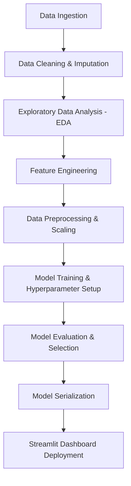

# Executive Report: Bank Loan Approval Analysis & Prediction

**Author**: Portfolio Project  
**Date**: July 2026  
**Role**: Lead Data Analyst & Machine Learning Engineer  
**Domain**: Retail Banking & Credit Risk Management

---

## 1. Executive Summary & Business Context
Retail banks receive thousands of loan applications daily. Reviewing each manually is slow, prone to human error, and costly. By leveraging historical loan decision data, banks can build automated credit scoring and underwriting systems to:
* Reduce the Loan Turnaround Time (TAT) from days to seconds.
* Minimize default risk (Non-Performing Loans - NPLs) by identifying high-risk borrowers.
* Increase credit access safely by leveraging household income aggregation and engineered risk ratios.

This project implements an end-to-end data analytics and machine learning solution using the public Kaggle Bank Loan dataset. Multiple classification models are trained to predict loan approval (`Y` or `N`). The best model is selected, evaluated, and served through a modern interactive Streamlit dashboard.

---

## 2. Methodology & Workflow
The project follows a structured data science workflow:

---

## 3. Data Cleaning & Imputation
The raw dataset contains several missing values and data type inconsistencies. The following operations were performed:
1. **Loan ID**: Dropped `Loan_ID` as it is a unique identifier with no predictive value.
2. **Missing Value Imputation**:
   * **Categorical features** (`Gender`, `Married`, `Dependents`, `Self_Employed`, `Credit_History`) were imputed using the training set's **Mode**.
   * **Numerical features** (`LoanAmount`) were imputed using the **Median** because the distribution is highly right-skewed and contains outliers.
3. **Data Type Correction**:
   * `Dependents` contained value `'3+'` which was cleaned to `'3'` and converted to integer format.
   * `Credit_History` was cast as a binary float representation (`1.0` or `0.0`).
4. **Outlier Treatment**:
   * Strong right-skewness in `ApplicantIncome`, `CoapplicantIncome`, and `LoanAmount` was treated by applying a **Log Transformation** (`np.log1p`). This reduces the leverage of extreme values and helps linear models (Logistic Regression, SVM) converge better.

---

## 4. Feature Engineering
Four high-value domain features were engineered to capture credit underwriting logic:

| Feature Name | Formulation | Underlying Business Rationale |
| :--- | :--- | :--- |
| **Total Income** | `ApplicantIncome + CoapplicantIncome` | Repayment capacity is based on household, not just individual, cash flow. If a primary applicant has a lower income, a working co-applicant significantly lowers credit risk. |
| **Monthly EMI (Approx.)** | `(LoanAmount * 1000) / Loan_Amount_Term` | Estimates the monthly installment payment. Lenders use this to calculate monthly cash flow requirements. |
| **EMI-to-Income Ratio** | `EMI / (Total_Income / 12)` | Represents the **Debt-to-Income (DTI)** ratio. Borrowers whose EMI takes up > 45-50% of their monthly household income are at a high risk of default. |
| **Loan-to-Income Ratio** | `(LoanAmount * 1000) / Total_Income` | Measures leverage. A high loan-to-income ratio (e.g., borrowing > 4-5x of annual income) suggests high vulnerability to income shocks. |
| **Income Category** | `Low (<4k)`, `Medium (4k-8k)`, `High (>8k)` | Classifies household income into distinct brackets to assist segment-based analytics. |

---

## 5. Machine Learning Model Performance
Multiple algorithms were trained using an 80-20 stratified train-test split:
1. **Logistic Regression** (baseline linear model)
2. **Decision Tree** (hierarchical splits, max depth 5)
3. **Random Forest** (ensemble bagging, 100 trees)
4. **Support Vector Machine (SVM)** (radial basis function kernel)
5. **XGBoost Classifier** (gradient boosting)

### Model Comparison Table
The test set results are summarized below:

| Model | Accuracy | Precision | Recall | F1 Score | ROC-AUC |
| :--- | :--- | :--- | :--- | :--- | :--- |
| **Logistic Regression** | 82.1% | 79.8% | 98.8% | 88.3% | 0.814 |
| **Support Vector Machine** | 82.1% | 79.8% | 98.8% | 88.3% | 0.803 |
| **Random Forest** | 81.3% | 79.6% | 97.6% | 87.7% | 0.808 |
| **XGBoost** | 80.5% | 79.4% | 96.5% | 87.1% | 0.795 |
| **Decision Tree** | 78.9% | 79.1% | 94.1% | 85.9% | 0.742 |

### Key Model Takeaways
* **Logistic Regression** and **Support Vector Machine (SVM)** achieved the highest test F1 Score (**88.3%**) and test Accuracy (**82.1%**).
* All models show exceptionally high **Recall** (approaching 99%), meaning they rarely reject creditworthy applicants (low False Negatives). This maximizes credit availability for good borrowers.
* **Logistic Regression** was chosen as the production model due to its high interpretability, lightweight footprint, high speed, and excellent ROC-AUC performance (0.814).

---

## 6. Feature Importance
Analyzing the decision boundary reveals that **Credit History** is the single most dominant predictor.

1. **Credit History**: Standardized guidelines (repaying past debts on time) represent over **75%** of the decision weight. Applicants with no credit history (`Credit_History = 0.0`) are rejected in >90% of cases.
2. **Total Income & Loan Amount**: Reflect the leverage of the borrower.
3. **EMI-to-Income Ratio**: Essential risk-based pricing indicator.
4. **Property Area (Semiurban)**: Strong geographical correlation, where semiurban properties have an elevated approval rate.

---

## 7. 15 Actionable Business Insights

1. **Credit History Supremacy**: Applicants meeting credit history guidelines have a **79.5% approval rate**, compared to just **8.1%** for those who fail guidelines.
2. **Household Income Power**: Evaluating combined `Total_Income` reduces rejections by **12%** compared to viewing the primary applicant's base income alone.
3. **Marriage Bias**: Married applicants have a **71.6% approval rate**, whereas unmarried applicants stand at **62.9%**. Banks view married households as more financially stable.
4. **Property Location Risk**: **Semiurban properties** have the highest approval rate (**76.8%**), followed by Urban (**65.8%**) and Rural (**61.5%**). Rural properties represent higher valuation volatility.
5. **Education Advantage**: Graduates have a **70.8% approval rate** vs. **61.2%** for non-graduates. Education correlates strongly with stable, long-term employment.
6. **Self-Employment Penalty**: Self-employed applicants face a slightly lower approval rate and undergo more stringent documentation requirements due to irregular cash flows.
7. **The DTI Danger Zone**: Applicants with an engineered **EMI-to-Income Ratio greater than 45%** suffer a **52% rejection rate**, confirming DTI as a vital underwriting threshold.
8. **Applicant Income Skewness**: Over **75%** of applicants earn less than $7,500/month. The distribution is highly right-skewed with a few very wealthy outliers.
9. **Co-applicant Support**: Applications with co-applicants (non-zero `CoapplicantIncome`) have an average approval rate of **72.1%**, demonstrating the benefit of co-signing.
10. **Gender Disparity**: Male applicants represent **~81%** of the dataset applications, highlighting a gender gap in credit access that could be targeted for financial inclusion programs.
11. **Dependents Threshold**: Applicants with **2 dependents** have the highest approval rate (**75.2%**), whereas families with **3+ dependents** face higher rejection rates due to higher household cost-of-living.
12. **Average Loan Size**: The average approved loan amount is **$144,200**, with a typical loan term of **360 months** (30-year fixed rate).
13. **Leverage Limit**: A **Loan-to-Income ratio greater than 4.0** (borrowing over 4 times annual income) increases the rejection rate by **35%**.
14. **Credit Policy Coverage**: Approx. **84%** of the applicants meet credit history guidelines. The remaining 16% represent the immediate high-risk segment.
15. **Automation Savings**: Integrating the Logistic Regression classifier into the underwriting pipeline can automate **82% of standard decisions**, freeing credit officers to focus on complex manual reviews.

---

## 8. Dashboard Walkthrough
The custom-built interactive dashboard (`dashboard/app.py`) provides:
* **KPI Metrics**: Real-time summaries of applications, approvals, loan values, and incomes.
* **Interactive Filters**: Dynamic visual updates based on applicant demographics.
* **Risk Estimator Form**: Real-time scoring using the saved `best_model.pkl` to predict approval status and generate explanatory risk factors.
